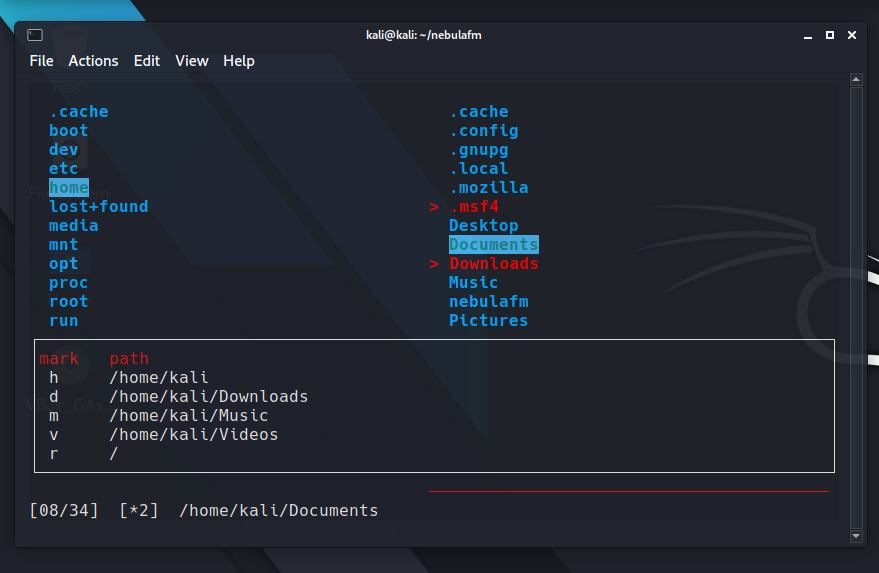

[logo](logo.png)

<h1 align="center">nebulafm</h1>

`nebulafm` is a minimalistic console-based twin-pane file manager with VI-like key bindings and shell integration

## Dependencies
- `ncursesw`
- `coreutils`
- `xdg-open`
- `libmagic`

## Installing from a clone
Compile the code:

    make

Install on the system:

    sudo make install
    
## Quick start
Run `nebulafm`, then you can use <kbd>h</kbd> <kbd>j</kbd> <kbd>k</kbd> <kbd>l</kbd> or the arrow keys to navigate the directory tree, <kbd>Enter</kbd> or <kbd>l</kbd> to open a file or <kbd>q</kbd> to quit

## Key Bindings
| Key | Function |
|:---:| --- |
| <kbd>tab</kbd> | Change the current panel |
| <kbd>space</kbd> | Select a file or directory |
| <kbd>h</kbd> | Go to the parent directory |
| <kbd>j</kbd> | Go down |
| <kbd>k</kbd> | Go up |
| <kbd>l</kbd> | Open a file or child directory |
| <kbd>z</kbd> | Show or hide hidden files |
| <kbd>d</kbd> | Delete files |
| <kbd>D</kbd> | Confirm the deletion |
| <kbd>y</kbd> | Copy files |
| <kbd>v</kbd> | Move files |
| <kbd>a</kbd> | Rename files |
| <kbd>g</kbd> | Go to the beginning of the current file list |
| <kbd>G</kbd> | Go to the end of the current file list |
| <kbd>H</kbd> | Move cursor to header (top) line |
| <kbd>M</kbd> | Move cursor to middle line |
| <kbd>L</kbd> | Move cursor to last line |
| <kbd>J</kbd> | Move down by a page |
| <kbd>K</kbd> | Move up by a page |
| <kbd>!</kbd> | Open the shell in the current directory |
| <kbd>V</kbd> | Add all files to the clipboard |
| <kbd>R</kbd> | Clear clipboard |
| <kbd>m</kbd> | Create a new directory |
| <kbd>f</kbd> | Create a new file |
| <kbd>i</kbd> | Preview file or directory |
| <kbd>b</kbd> | Add a new bookmark |
| <kbd>\'</kbd> | Open bookmark list |
| <kbd>Z</kbd> | Delete the bookmark |
| <kbd>/</kbd> | Search in the current directory |
| <kbd>n</kbd> | The next match in the file list |

*Key bindings can be customized in the file config.h*

# Directories used
The clipboard file is located in `$HOME/.config/nebulafm/clipboard`

The bookmarks file is located in `$HOME/.config/nebulafm/bookmarks`

# Help
`man nebulafm`
